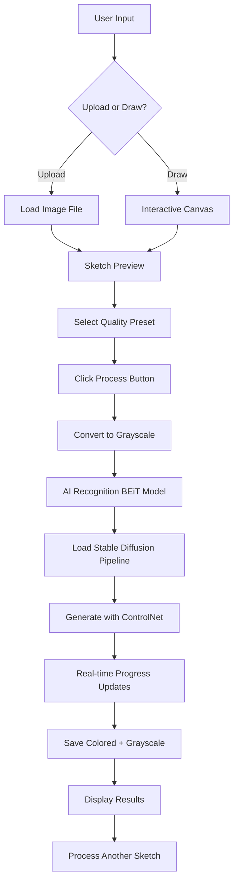

# 🎨 Handsketch Recognition and Colorization

An advanced AI-powered web application that transforms hand-drawn sketches into realistic colored images using state-of-the-art machine learning models. Built with Streamlit and powered by Stable Diffusion, this application offers an intuitive interface for creating, recognizing, and colorizing sketches with professional-quality results.

## ✨ Key Highlights

### 🤖 **Advanced AI Pipeline**
- **Sketch Recognition**: BEiT transformer model for accurate object classification
- **Image Generation**: Stable Diffusion + ControlNet for realistic colorization
- **Dual Output**: Both colored and grayscale realistic versions
- **Performance Optimized**: 4-tier quality system (Fast/Medium/High/Ultra)

### 🎯 **User Experience**
- **Interactive Canvas**: Draw directly in the browser with real-time feedback
- **Upload Support**: Use existing sketches or images
- **Live Progress**: Real-time progress tracking with ETA estimation
- **15-Second Updates**: Consistent progress callbacks every 15 seconds
- **Modern UI**: Clean, professional interface with gradient animations

### ⚡ **Performance Features**
- **Smart Presets**: 4 optimized quality levels (5-50 inference steps)
- **Adaptive Timing**: Automatic hardware detection and recommendations
- **Memory Efficient**: Optimized for both CPU and GPU processing
- **Lazy Loading**: Models load only when needed for faster startup

## 🚀 Quick Start from GitHub

### 1. **Clone and Setup**
```bash
# Clone the repository
git clone https://github.com/[username]/handsketch-recognition-colorization.git
cd handsketch-recognition-colorization

# Create and activate virtual environment
python -m venv .venv
source .venv/bin/activate  # On Windows: .venv\Scripts\activate

# Install dependencies
pip install -r requirements.txt
```

### 2. **Run the Application**
```bash
# Start the Streamlit app
python -m streamlit run app.py --server.port 8501

# Or use the activation script (if available)
source activate_env.sh
streamlit run app.py
```

### 3. **Access the Application**
- **Local URL**: http://localhost:8501
- **Network URL**: Available for mobile/tablet testing

## 🎮 How to Use

### **Step 1: Create Your Sketch**
- **Option A**: Upload an existing sketch image (PNG, JPG, JPEG)
- **Option B**: Draw directly on the interactive canvas
- **Preview**: See your sketch before processing

### **Step 2: Choose Quality Level**
- **⚡ Fast (5 steps)**: ~30 seconds, good for quick tests
- **⚖️ Medium (10 steps)**: ~1 minute, balanced quality/speed
- **🎨 High (20 steps)**: ~2 minutes, great quality
- **💎 Ultra (50 steps)**: ~5 minutes, maximum quality

### **Step 3: Process with AI**
- Click "🎯 Process Sketch with AI"
- Watch real-time progress with 15-second updates
- See live ETA for total process completion

### **Step 4: View Results**
- **Recognition Results**: Object classification with confidence score
- **Triple View**: Original sketch, generated grayscale, and colorized versions
- **High Quality**: Professional-grade AI-generated images

## 🛠️ Project Workflow



## 🏗️ Technical Architecture

### **Core Components**
- **`app.py`**: Main Streamlit interface with progress tracking
- **`src/recognition.py`**: BEiT model for sketch classification
- **`src/colorize_robust.py`**: Optimized Stable Diffusion pipeline
- **`src/grayscale.py`**: Image preprocessing utilities
- **`performance_config.py`**: 4-tier performance system

### **AI Models Used**
| Model | Purpose | Size | Provider |
|-------|---------|------|----------|
| `kmewhort/beit-sketch-classifier` | Sketch Recognition | ~348MB | Hugging Face |
| `lllyasviel/sd-controlnet-scribble` | Sketch Control | ~1.45GB | Hugging Face |
| `runwayml/stable-diffusion-v1-5` | Image Generation | ~4GB | Hugging Face |

### **Performance Optimizations**
- **15-Second Callbacks**: Consistent UI updates regardless of processing speed
- **Lazy Model Loading**: Models load only when needed
- **Memory Management**: Automatic cleanup and optimization
- **Device Detection**: Automatic CPU/GPU configuration
- **Parallel Processing**: Background model loading during recognition

## 📊 Performance Presets

| Preset | Steps | Size | Time | Best For |
|--------|-------|------|------|----------|
| **Fast** | 5 | 256px | ~30s | Quick demos, testing |
| **Medium** | 10 | 384px | ~1min | Daily use, good balance |
| **High** | 20 | 512px | ~2min | Quality results |
| **Ultra** | 50 | 768px | ~5min | Maximum quality, presentations |

## 💡 Tips for Best Results

### **Drawing Tips**
- **Clear Outlines**: Use bold, clear strokes
- **Simple Objects**: Animals, objects, and recognizable shapes work best
- **Avoid Text**: Focus on drawable objects rather than text
- **Clean Background**: Use white/light backgrounds

### **Performance Tips**
- **CPU Users**: Stick to Fast (5 steps) or Medium (10 steps)
- **GPU Users**: Can use High (20 steps) or Ultra (50 steps)
- **First Time**: Try Medium preset for best balance
- **Memory Limited**: Use Fast preset to reduce memory usage

## 🔧 Hardware Requirements

### **Minimum Requirements**
- **RAM**: 8GB+ recommended
- **Storage**: 10GB free space (for AI models)
- **Internet**: Required for initial model download
- **Python**: 3.8+ (3.13 tested)

### **Recommended Setup**
- **GPU**: CUDA-compatible GPU with 6GB+ VRAM
- **RAM**: 16GB+ for smooth operation
- **CPU**: Multi-core processor for CPU-only mode
- **SSD**: For faster model loading

## 📁 Project Structure

```
.
├── README.md                 # This documentation
├── app.py                    # Main Streamlit application
├── requirements.txt          # Python dependencies
├── performance_config.py     # Quality presets configuration
├── cpu_optimizations.py     # CPU performance optimizations
├── activate_env.sh          # Environment activation script
├── .gitignore               # Git ignore rules
├── .venv/                   # Virtual environment
├── src/
│   ├── colorize_robust.py   # Advanced Stable Diffusion pipeline
│   ├── colorize.py          # Basic colorization module
│   ├── recognition.py       # BEiT sketch classifier
│   └── grayscale.py         # Image preprocessing
├── datasets/                # Input images (temporary)
└── outputs/                 # Generated results
```

## 🚀 Development Features

### **Real-time Progress System**
- **15-Second Intervals**: Consistent callback timing
- **Total Process ETA**: Shows complete workflow completion time
- **Step-by-Step Updates**: Live progress through all phases
- **Adaptive Timing**: Adjusts estimates based on actual performance

### **Modern UI/UX**
- **Gradient Progress Bars**: Beautiful animated indicators
- **Professional Styling**: Clean, modern interface
- **Responsive Design**: Works on desktop, tablet, mobile
- **Interactive Canvas**: Smooth drawing experience

### **Advanced Optimizations**
- **Pipeline Caching**: Reuse loaded models for speed
- **Memory Management**: Automatic cleanup and optimization
- **Device Detection**: Smart hardware configuration
- **Parallel Processing**: Background operations for efficiency

## 🎯 Perfect For

✅ **Educators**: Teaching AI and computer vision concepts  
✅ **Artists**: Exploring AI-assisted creative workflows  
✅ **Developers**: Learning Stable Diffusion and Streamlit  
✅ **Researchers**: Studying sketch-to-image generation  
✅ **Presentations**: Impressive AI demonstrations  
✅ **Prototyping**: Quick concept visualization  

## 🤝 Contributing

We welcome contributions! Areas for improvement:
- Additional sketch recognition models
- New performance optimization techniques
- UI/UX enhancements
- Documentation improvements
- Testing and bug fixes

## 📄 License

This project is open-source and available under the MIT License.

---

**🎨 Transform your sketches into stunning AI-generated artwork with professional-quality results!** 🚀
